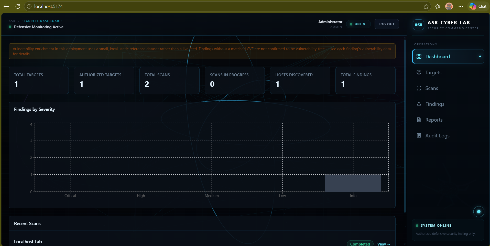
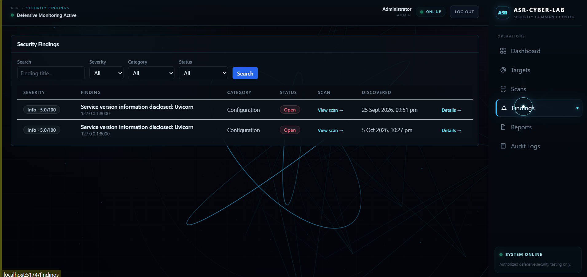
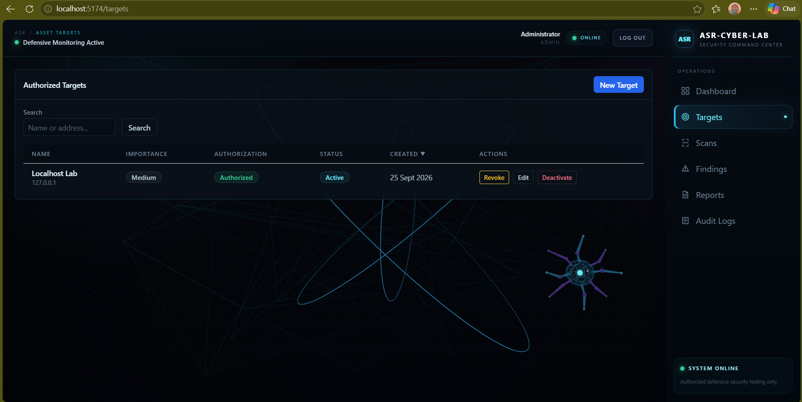
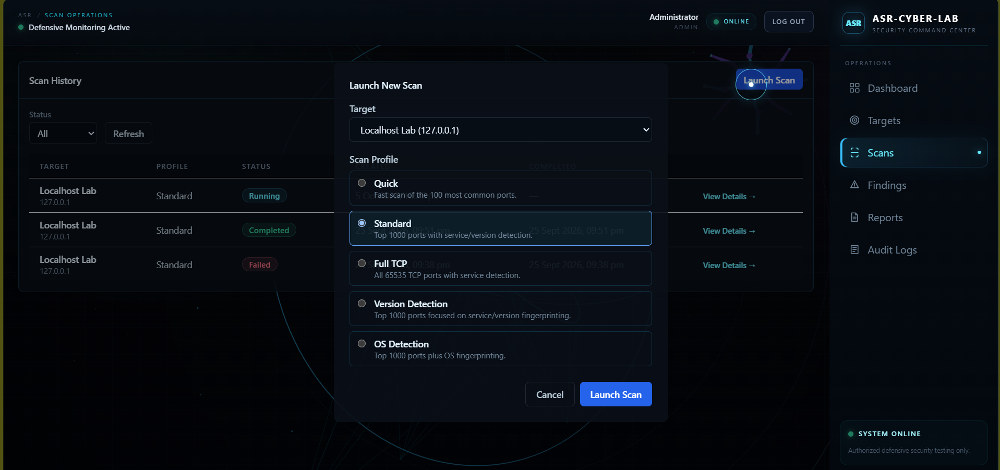
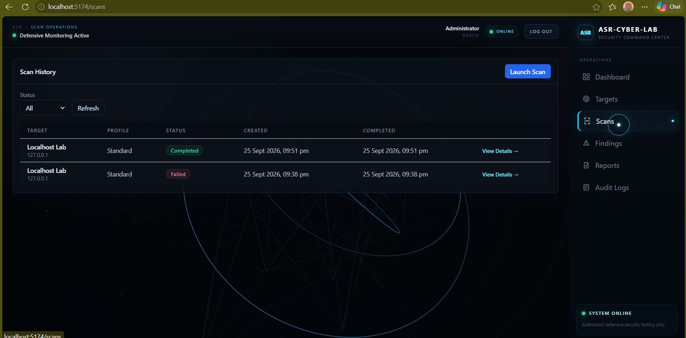
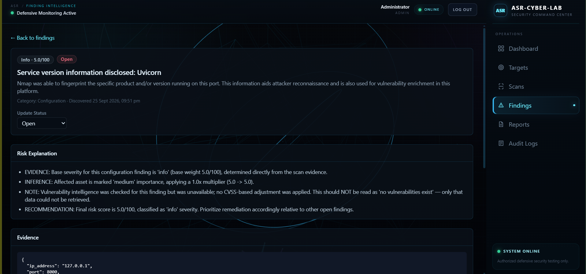
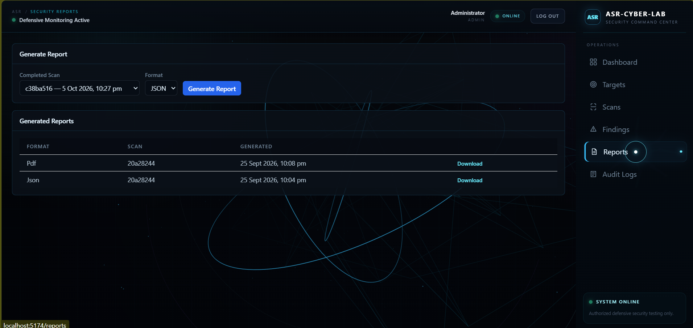
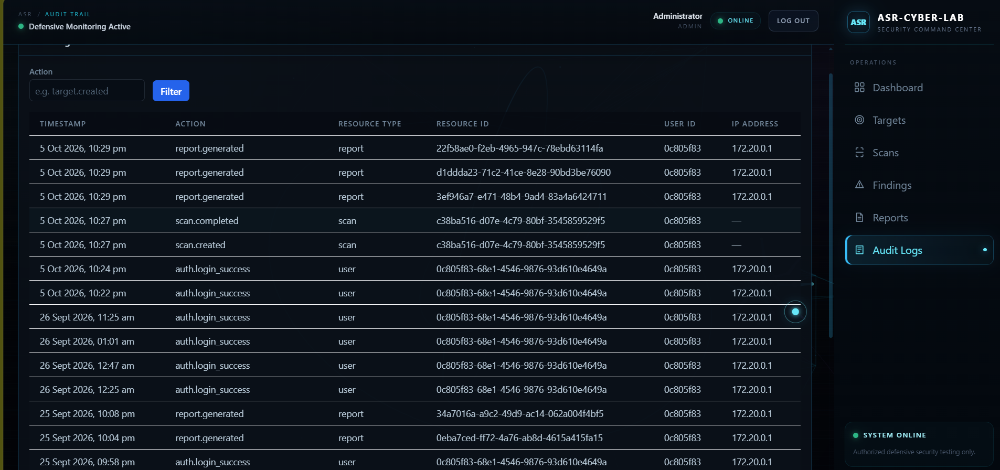
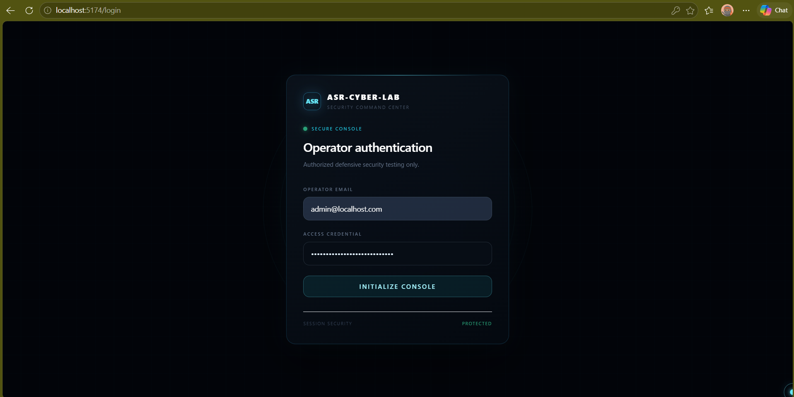
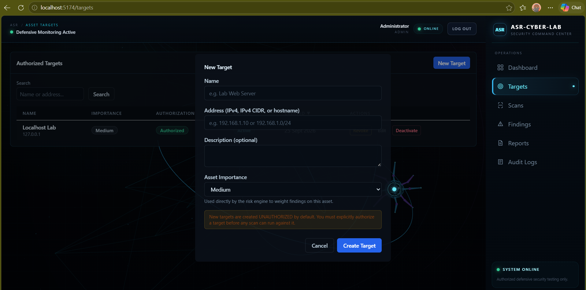

# 🛡️ ASR-Cyber-Lab

### Automated Security Reconnaissance & Attack-Surface Reduction Platform

<p align="center">
  <strong>Defensive Security Reconnaissance • Attack-Surface Analysis • Risk Assessment</strong>
</p>

<p align="center">
  
  
</p>

<p align="center">
  
  
</p>

<p align="center">
  
  
</p>

<p align="center">
  
  
</p>

<p align="center">
  
  
</p>

---

ASR-Cyber-Lab is a defensive cybersecurity platform for authorized environments. It discovers exposed assets and services, analyzes security configuration, calculates contextual risk, and generates actionable security reports.

## Overview
## Overview

ASR-Cyber-Lab provides a complete workflow for authorized security reconnaissance:

- Discover exposed hosts and services
- Enumerate ports and service versions using Nmap
- Analyze security configuration
- Enrich findings with vulnerability information
- Calculate contextual risk scores
- Manage security findings
- Generate JSON and PDF reports
- Maintain audit logs
- Visualize results through a dark cyber-themed dashboard
- Display interactive 3D security visualization using Three.js

## Key Features

- JWT-based authentication
- Target management with authorization gates
- Nmap port and service enumeration
- Security configuration analysis
- Vulnerability enrichment
- Contextual risk scoring
- Findings and alerts management
- JSON/PDF report generation
- Audit logging
- React + TypeScript dashboard
- Three.js 3D visualization

## Security Philosophy

ASR-Cyber-Lab is intended only for authorized defensive security testing, including:

- Systems you own
- Localhost environments
- Private security labs
- Authorized CTF/lab environments
- Systems where you have explicit permission to test

The project does **not** aim to provide:

- Unauthorized scanning
- Credential theft
- Malware
- Persistence mechanisms
- Destructive exploitation
- Evasion techniques
- Unauthorized access

The authorization gate is a core part of the reconnaissance lifecycle.

## Architecture

```text
User / Analyst
      |
      v
React Dashboard
(React + TypeScript + Tailwind + Three.js)
      |
      v
FastAPI API
      |
      +--------------------+
      |                    |
      v                    v
Target Management      Scan Engine
                           |
                          Nmap
                           |
                           v
                    Result Normalizer
                           |
                           v
                    Security Analysis
                           |
                           v
                      Risk Engine
                           |
                           v
                    Findings / Alerts
                           |
                           v
                    Reports JSON/PDF
                           |
                           v
                       PostgreSQL
                  (SQLAlchemy + Alembic)

Core Principle:
Authorization gates the reconnaissance lifecycle.
```

## Technology Stack

### Frontend

- React
- TypeScript
- Vite
- Tailwind CSS
- Three.js
- Recharts
- Axios
- React Router

### Backend

- Python
- FastAPI
- Pydantic
- SQLAlchemy
- Alembic
- PostgreSQL
- JWT
- Pytest

### Security

- Nmap
- Npcap

### Infrastructure

- Docker
- Docker Compose
- Git
- GitHub

## System Requirements

Supported environments:

- Windows 10/11 64-bit
- Linux
- macOS

The project is primarily tested on Windows.

## Required Software

### Git 2.x+

Verify:

```bash
git --version
```

Download:
https://git-scm.com/downloads

### Docker Desktop / Docker Engine

Recommended:

- Docker Engine 29.x
- Docker Compose v2.x

Verify:

```bash
docker --version
docker compose version
```

Download:
https://www.docker.com/products/docker-desktop/

### Node.js 20 LTS+

The project was also developed using Node.js 24.x.

Verify:

```bash
node --version
npm --version
```

Download:
https://nodejs.org/

### Python 3.10.x

Verify:

```bash
python --version
```

Download:
https://www.python.org/downloads/

### Nmap 7.90+

The project has been tested with Nmap 7.99.x.

Verify:

```bash
nmap --version
```

Download:
https://nmap.org/download.html

On Windows, install Npcap and make sure Nmap is available in PATH.

## Project Structure

```text
ASR-Cyber-Lab/
│
├── backend/
│   ├── app/
│   │   ├── api/
│   │   ├── core/
│   │   ├── models/
│   │   ├── schemas/
│   │   ├── services/
│   │   └── main.py
│   │
│   ├── migrations/
│   ├── tests/
│   ├── reports_output/
│   ├── requirements.txt
│   └── Dockerfile
│
├── frontend/
│   ├── src/
│   │   ├── components/
│   │   ├── layouts/
│   │   ├── pages/
│   │   ├── services/
│   │   └── ...
│   │
│   ├── package.json
│   ├── vite.config.ts
│   ├── tailwind.config.js
│   ├── postcss.config.js
│   └── Dockerfile
│
├── docs/
├── docker-compose.yml
├── .env.example
├── .gitignore
└── README.md
```

## Installation

Clone the repository:

```bash
git clone https://github.com/vardhan0666/ASR-Cyber-Lab.git
cd ASR-Cyber-Lab
```

## Configuration

Create the `.env` file.

### Windows CMD

```cmd
copy .env.example .env
```

### Windows PowerShell

```powershell
Copy-Item .env.example .env
```

### Linux/macOS

```bash
cp .env.example .env
```

Configure the environment variables:

```env
ENVIRONMENT=development
LOG_LEVEL=INFO

POSTGRES_USER=your_database_user
POSTGRES_PASSWORD=your_strong_database_password
POSTGRES_DB=asr_cyber_lab
POSTGRES_PORT=5433

DATABASE_URL=your_database_connection_string

SECRET_KEY=your_random_secret_key
ALGORITHM=HS256
ACCESS_TOKEN_EXPIRE_MINUTES=60

BACKEND_PORT=8001

CORS_ORIGINS=http://localhost:5173,http://localhost:5174

NMAP_PATH=nmap
NMAP_TIMEOUT_SECONDS=600

AI_ENABLED=false
AI_PROVIDER=none
AI_API_KEY=

INITIAL_ADMIN_EMAIL=admin@localhost.com
INITIAL_ADMIN_PASSWORD=your_strong_admin_password
INITIAL_ADMIN_FULL_NAME=Administrator

FRONTEND_PORT=5173
VITE_API_BASE_URL=http://localhost:8001
```

**Never commit `.env` to GitHub.**

The repository ignores:

```text
.env
.env.local
.env.*.local
```

## Running the Project

### Start Backend and Database

From the project root:

```bash
docker compose up -d
```

Check running containers:

```bash
docker ps
```

Check backend health:

```bash
curl http://localhost:8001/api/health
```

On Windows PowerShell:

```powershell
curl.exe http://localhost:8001/api/health
```

Expected response:

```json
{
  "status": "ok",
  "environment": "development"
}
```

### Start Frontend

Open another terminal:

```bash
cd frontend
npm install
npm run dev
```

Vite normally starts at:

```text
http://localhost:5173
```

or:

```text
http://localhost:5174
```

if port 5173 is already in use.

## Complete Startup Workflow

### Terminal 1

```bash
docker compose up -d
```

### Terminal 2

```bash
cd frontend
npm install
npm run dev
```

Then open the Vite URL shown in the terminal.

Log in using the initial administrator credentials configured in `.env`.

## Using the Application

The normal workflow is:

```text
Login
  ↓
Dashboard
  ↓
Create Target
  ↓
Confirm Authorization
  ↓
Select Scan Profile
  ↓
Start Scan
  ↓
Monitor Scan
  ↓
Review Hosts
  ↓
Review Services
  ↓
Review Findings
  ↓
Review Risk
  ↓
Generate Report
  ↓
Review Audit Logs
```

## Running a Security Scan

For the first test, use an authorized local target:

```text
127.0.0.1
```

or:

```text
localhost
```

Recommended first scan profile:

```text
Standard
```

Only scan systems for which you have explicit authorization.

## Example Local Validation

A typical local validation can discover:

```text
Target: 127.0.0.1
Port: 8000/tcp
Service: Uvicorn
```

An informational finding may report:

```text
Service version information disclosed: Uvicorn
```

An example risk score may be:

```text
5.0 / 100
```

Exact results depend on the services running on the local machine.

## Findings and Risk

Severity levels include:

```text
INFO
LOW
MEDIUM
HIGH
CRITICAL
```

Findings can contain:

- Category
- Severity
- Description
- Evidence
- Risk Score
- Status
- Remediation

The risk engine provides contextual scoring rather than treating every exposed service as equally dangerous.

## Reports

The platform supports:

- JSON reports
- PDF reports

Reports are generated from scan results and stored in the local report output directory.

## Audit Logs

Important audit events include:

```text
target.created
target.authorization_changed
scan.created
scan.completed
report.generated
```

Audit logging helps track security-relevant actions performed through the platform.

## Testing

### Backend Health Check

```bash
curl http://localhost:8001/api/health
```

Windows PowerShell:

```powershell
curl.exe http://localhost:8001/api/health
```

### Frontend Build

```bash
cd frontend
npm run build
```

### Preview Production Build

```bash
npm run preview
```

### Backend Tests

Run the backend test suite according to the configured project test setup.

## Docker Commands

Start services:

```bash
docker compose up -d
```

Rebuild and start:

```bash
docker compose up -d --build
```

Restart:

```bash
docker compose restart
```

View containers:

```bash
docker ps
```

View backend logs:

```bash
docker compose logs backend
```

Follow backend logs:

```bash
docker compose logs -f backend
```

View PostgreSQL logs:

```bash
docker compose logs postgres
```

Stop containers:

```bash
docker compose down
```

## Troubleshooting

### PostgreSQL Port 5432 Conflict

If PostgreSQL is already using port 5432, configure:

```env
POSTGRES_PORT=5433
```

Then recreate the services.

### Backend Port 8001 Conflict

Check the port:

```cmd
netstat -ano | findstr :8001
```

Change `BACKEND_PORT` if required and update:

```env
VITE_API_BASE_URL=http://localhost:<new-port>
```

Then recreate the backend:

```bash
docker compose up -d --force-recreate backend
```

### Frontend Cannot Connect to Backend

Check backend health:

```bash
curl http://localhost:8001/api/health
```

Verify the frontend environment variable:

```env
VITE_API_BASE_URL=http://localhost:8001
```

Restart Vite after changing environment variables.

### CORS Problems

Configure:

```env
CORS_ORIGINS=http://localhost:5173,http://localhost:5174
```

Then recreate the backend:

```bash
docker compose up -d --force-recreate backend
```

### Nmap Not Found

Check:

```bash
nmap --version
```

If the command fails:

1. Install Nmap.
2. Install Npcap on Windows.
3. Add Nmap to PATH.
4. Confirm `NMAP_PATH=nmap`.

### Docker Changes Are Not Appearing

Rebuild:

```bash
docker compose up -d --build
```

Or force recreation:

```bash
docker compose up -d --force-recreate backend
```

### Frontend Dependencies Missing

Run:

```bash
cd frontend
npm install
```

## Stopping the Project

Stop the frontend with:

```text
Ctrl + C
```

Stop Docker services:

```bash
docker compose down
```

To also remove the PostgreSQL volume:

```bash
docker compose down -v
```

**Warning:** Removing volumes can delete local PostgreSQL data.

## Fresh Clone Setup

For a new machine:

1. Install Git.
2. Install Docker Desktop.
3. Install Node.js.
4. Install Python.
5. Install Nmap and Npcap.
6. Clone the repository.
7. Enter the project directory.
8. Create `.env`.
9. Configure database credentials and secret key.
10. Configure backend and frontend ports.
11. Configure CORS.
12. Configure Nmap.
13. Configure the initial admin account.
14. Start Docker services.
15. Check the backend health endpoint.
16. Install frontend dependencies.
17. Start the frontend.

Example:

```bash
git clone https://github.com/vardhan0666/ASR-Cyber-Lab.git
cd ASR-Cyber-Lab
docker compose up -d
cd frontend
npm install
npm run dev
```

## GitHub Development Workflow

Check changes:

```bash
git status
```

Stage changes:

```bash
git add .
```

Commit:

```bash
git commit -m "Describe your changes"
```

Push:

```bash
git push
```

Update the local repository:

```bash
git pull
```

If frontend dependencies changed:

```bash
npm install
```

## What GitHub Does Not Store

GitHub does not store:

- Running Docker containers
- Running databases
- Local database records
- `.env` secrets
- `node_modules`
- Python virtual environments
- Generated build files
- Temporary logs

Only project source/configuration that is intentionally committed should be pushed.

## Documentation Assets

Documentation assets include:

```text
docs/
├── presentation/
│   └── ASR-Cyber-Lab-Presentation.pptx
└── images/
    ├── architecture.png
    ├── dashboard.png
    ├── scan-results.png
    ├── findings.png
    └── reports.png
```

Use real project screenshots for documentation. Avoid fake results.

## Engineering Design

The system follows a layered architecture:

```text
Presentation
     ↓
API
     ↓
Business Logic
     ↓
Security / Recon Engine
     ↓
Risk Engine
     ↓
Persistence
     ↓
PostgreSQL
```

This structure supports:

- Maintenance
- Testing
- Extension
- Debugging
- Scalability

## Defensive Design

The core defensive sequence is:

```text
Target
  ↓
Authorization Check
  ↓
Scan
```

Authorization is checked before reconnaissance begins.

## Security Pipeline

```text
Authorized Target
      ↓
Nmap Recon
      ↓
Host Discovery
      ↓
Service Discovery
      ↓
Security Analysis
      ↓
Risk Calculation
      ↓
Security Findings
      ↓
Remediation
      ↓
JSON / PDF Report
```

## Current Validation

The current validation focuses on authorized local testing.

Example:

```text
127.0.0.1
```

A local application may expose:

```text
8000/tcp
```

with:

```text
Uvicorn
```

The platform can normalize the discovered service, perform security analysis, calculate contextual risk, create findings, and generate reports.

Exact results vary according to the services running on the test machine.

## Future Roadmap

### AI-Assisted Remediation

Planned capabilities include:

- Natural-language remediation
- Finding prioritization
- Report summaries
- Context-aware recommendations

### Threat Intelligence

Potential integrations include:

- CVE information
- Threat feeds
- Vulnerability databases
- Reputation information

### Cloud Security

Future support may include:

- AWS
- Azure
- Google Cloud

### Continuous Monitoring

Planned capabilities:

- Scheduled scans
- Change detection
- Exposure tracking
- Security alerts

### SIEM / SOC Integration

Potential integrations include security monitoring and SOC workflows.

## Long-Term Vision

The long-term security platform vision is:

```text
ASR-Cyber-Lab
"What is exposed?"
        ↓
SENTINEL-X
"What is happening?"
        ↓
AERION
"What does it mean?"
```

The larger pipeline becomes:

```text
Attack Surface
      ↓
Security Telemetry
      ↓
Threat Detection
      ↓
Risk Analysis
      ↓
Security Intelligence
      ↓
Defensive Response
```

## Project Goals

ASR-Cyber-Lab combines:

- Cybersecurity
- Network reconnaissance
- Secure software engineering
- Full-stack development
- REST API development
- Database engineering
- Authentication
- Risk analysis
- Security reporting
- Docker
- DevOps
- Interactive visualization
- 3D web development

## Learning Outcomes

### Cybersecurity

- Network reconnaissance
- Attack-surface discovery
- Security analysis
- Risk assessment
- Defensive security practices

### Backend

- FastAPI
- REST APIs
- Authentication
- Database integration
- Service architecture

### Frontend

- React
- TypeScript
- Tailwind CSS
- Data visualization
- Three.js

### Infrastructure

- Docker
- Docker Compose
- PostgreSQL
- Environment configuration

### Software Engineering

- Layered architecture
- Testing
- Documentation
- Git/GitHub workflow
- Maintainable project structure

## Security Notes

Always:

- Scan only authorized targets.
- Respect organizational policies.
- Follow defined testing scope.
- Protect credentials and API keys.
- Avoid committing secrets.
- Use responsible disclosure for discovered vulnerabilities.

Never use the platform to scan or attack systems without explicit permission.

## Disclaimer

ASR-Cyber-Lab is provided for authorized defensive security testing and educational purposes only.

Do not scan, probe, attack, or otherwise interact with systems without explicit authorization.

The developer is not responsible for misuse of this project.

Users are responsible for following:

- Applicable laws
- Organizational policies
- Responsible disclosure practices
- Scope restrictions
- Authorized testing rules

Use the platform responsibly and only within environments where you have permission.

## Author

### Vardhan

CSE Student

Interests:

- Cybersecurity
- AI
- Software Engineering
- Full-Stack Development
- Security Research
- Technology

GitHub:
https://github.com/vardhan0666

Project:
https://github.com/vardhan0666/ASR-Cyber-Lab

### Support

If you find the project useful:

- Star the repository
- Fork the project
- Report issues
- Suggest improvements
- Contribute responsibly

---

**Discover the attack surface. Understand the risk. Reduce the exposure.**
